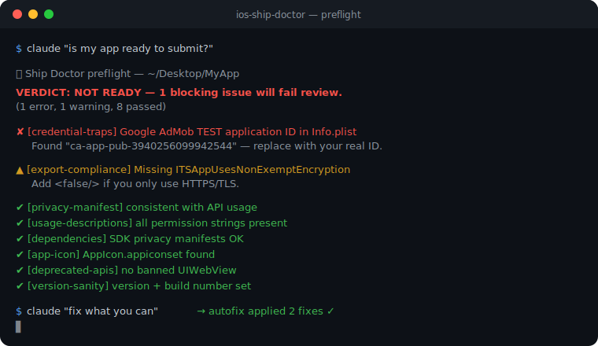

<div align="center">

# 🩺 iOS Ship Doctor

**Catch App Store rejections *before* you hit Submit.**

An [MCP](https://modelcontextprotocol.io) server that lets Claude diagnose why your iOS app will be rejected — privacy manifests, missing permission strings, unlisted SDKs, leftover test credentials — and then fix them. When Apple *does* reject you, it pulls the rejection and maps it to a plain-English fix.

[](https://github.com/menansali/ios-ship-doctor/actions/workflows/ci.yml)
[](./LICENSE)
[](https://nodejs.org)
[](https://modelcontextprotocol.io)

<br/>



</div>

---

## Why

Apple's review pipeline silently rejects builds for things you can't see in Xcode:

- A required-reason API used in code but **not declared** in `PrivacyInfo.xcprivacy`
- A permission used with **no `NS…UsageDescription`** string (instant crash + reject)
- A third-party SDK on Apple's list shipping **without its own privacy manifest**
- A **placeholder test credential** (like Google's sample AdMob ID) left in `Info.plist`

Each one costs you a submission cycle — hours or days of round-trips. Ship Doctor checks all of them in seconds and tells you exactly what to change.

> Existing App Store MCPs are thin API wrappers that *submit* your app. Ship Doctor is the one that tells you **why it won't pass** first.

## Quickstart

```bash
git clone https://github.com/menansali/ios-ship-doctor.git
cd ios-ship-doctor
npm install && npm run build
npm link           # exposes the `ios-ship-doctor-mcp` command
```

Add it to Claude Code:

```bash
claude mcp add ios-ship-doctor -- ios-ship-doctor-mcp
```

Then just ask:

> **Is `/path/to/my-app` ready to submit to the App Store?**

## Example

```
🩺 Ship Doctor preflight — /Users/you/Desktop/MyApp

VERDICT: NOT READY — 1 blocking issue will fail App Store review.
(1 error, 1 warning, 6 passed)

❌ [credential-traps] Google AdMob TEST application ID in Info.plist
   Found placeholder/test value "ca-app-pub-3940256099942544".
   ↳ MyApp/Info.plist
   💡 Replace GADApplicationIdentifier with your real ca-app-pub-… ID.

⚠️ [export-compliance] Missing ITSAppUsesNonExemptEncryption in Info.plist
   Without this key, App Store Connect prompts about encryption on every submission.
   💡 Add <key>ITSAppUsesNonExemptEncryption</key><false/> if you only use HTTPS/TLS.

✅ [privacy-manifest] Privacy manifest consistent with API usage
✅ [usage-descriptions] All permission strings present
✅ [dependencies] SDK privacy manifests OK
✅ [app-icon] App icon asset found
```

## Tools

### Preflight — local, no credentials

| Tool | What it catches |
|------|-----------------|
| `preflight` | Runs every check below → single **READY / NOT READY** verdict |
| `scan_privacy_manifest` | Required-reason APIs used but undeclared, invalid reason codes, missing manifest |
| `check_usage_descriptions` | Camera / location / photos / mic / tracking used with no `NS…UsageDescription` |
| `audit_dependencies` | Apple-listed SDKs shipping without a `PrivacyInfo.xcprivacy` |
| `check_credential_traps` | Placeholder / public test credentials in `Info.plist` |
| `check_legal_links` | Missing Privacy Policy / Terms of Use (EULA) links on a paywall + in the App Store description (3.1.2) |
| `check_account_requirements` | No demo account for App Review (2.1), missing in-app account deletion (5.1.1(v)), social login without Sign in with Apple (4.8) |
| `check_external_payments` | Stripe/PayPal/Paddle for digital content with no StoreKit (3.1.1) |
| `check_background_modes` | `UIBackgroundModes` entries the app never actually implements (2.5.4) |
| `check_placeholder_content` | Lorem ipsum, Stripe test keys, `YOUR_API_KEY`, example.com dead links, template app names (2.1) |
| `generate_privacy_manifest` | Writes a valid `PrivacyInfo.xcprivacy` covering every detected API |
| `autofix` | Applies the safe fixes automatically; reports the rest as manual follow-up |

`preflight` also checks **export compliance**, **App Transport Security**, **app-icon presence**, **banned APIs** (`UIWebView`), **launch screen**, **version/build sanity**, and **deployment target**. Dependency scanning covers both **CocoaPods and Swift Package Manager**.

### Rejection recovery — needs an App Store Connect API key

| Tool | What it does |
|------|--------------|
| `asc_list_apps` | Lists your apps (id, name, bundle id) |
| `asc_get_rejections` | Pulls recent rejections, maps Review Guideline numbers → summaries + fixes |
| `asc_check_submission` | The metadata half of preflight: demo credentials actually filled in, review notes, required screenshot sets |
| `explain_guideline` | Explains any Review Guideline number (offline, no key needed) |

<details>
<summary><b>Enabling rejection recovery</b></summary>

Create a key at **App Store Connect → Users and Access → Integrations → App Store Connect API**, download the `.p8`, and add env vars to the MCP config:

```json
{
  "mcpServers": {
    "ios-ship-doctor": {
      "command": "ios-ship-doctor-mcp",
      "env": {
        "ASC_KEY_ID": "XXXXXXXXXX",
        "ASC_ISSUER_ID": "xxxxxxxx-xxxx-xxxx-xxxx-xxxxxxxxxxxx",
        "ASC_PRIVATE_KEY_PATH": "/absolute/path/to/AuthKey_XXXXXXXXXX.p8"
      }
    }
  }
}
```

The `.p8` never enters the repo — it stays on your machine and is read at runtime.
</details>

## Manual configuration

If you'd rather not use `npm link`, point Claude at the built file directly:

```json
{
  "mcpServers": {
    "ios-ship-doctor": {
      "command": "node",
      "args": ["/absolute/path/to/ios-ship-doctor/dist/index.js"]
    }
  }
}
```

`projectPath` in any tool can be your repo root (with an `ios/` folder) or the `ios/` directory itself.

## Use it in CI (no Claude required)

The same binary runs as a one-shot command that exits non-zero on blocking issues:

```bash
ios-ship-doctor-mcp preflight /path/to/app          # human-readable
ios-ship-doctor-mcp preflight /path/to/app --json   # machine-readable
```

Copy [`examples/preflight-gate.yml`](./examples/preflight-gate.yml) into your app repo's `.github/workflows/` to **block PRs that would fail App Store review**.

## How it works

- **Required-reason APIs** — scans first-party source for Apple's documented API signatures, then diffs against your declared `PrivacyInfo.xcprivacy`.
- **App Store Connect auth** — an ES256 JWT signed with Node's built-in `crypto` (no `jsonwebtoken` dependency), in the JOSE (IEEE-P1363) format Apple requires.
- **Safe by default** — everything is read-only except `generate_privacy_manifest` with `write=true`.

## Roadmap

- [x] Auto-fix tools (patch `Info.plist`, generate privacy manifest)
- [x] More preflight checks: launch screen, version sanity, deployment target
- [x] SwiftPM dependency scanning
- [x] CLI + CI mode
- [ ] Entitlements sanity (push, app groups, associated domains)
- [ ] Privacy nutrition-label cross-check against SDK data collection
- [ ] Draft reviewer replies from a rejection

## Contributing

Issues and PRs welcome. Adding a check usually means one entry in `src/knowledge.ts` plus a small function in `src/scanner.ts`.

## License

[MIT](./LICENSE) © menansali
